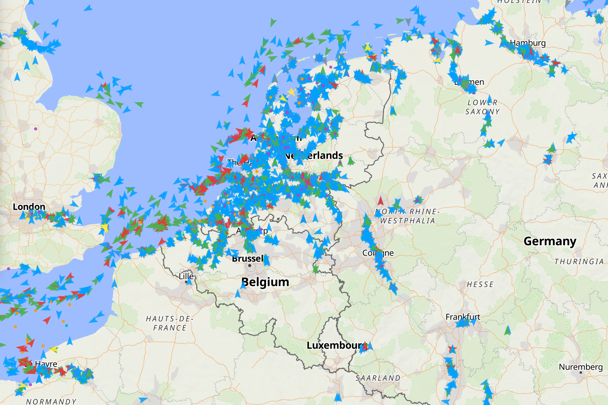
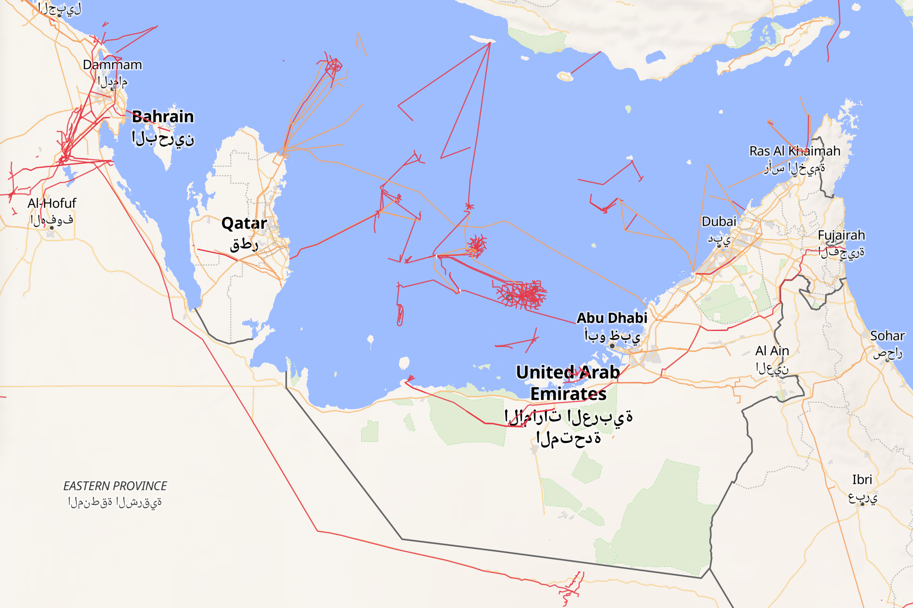
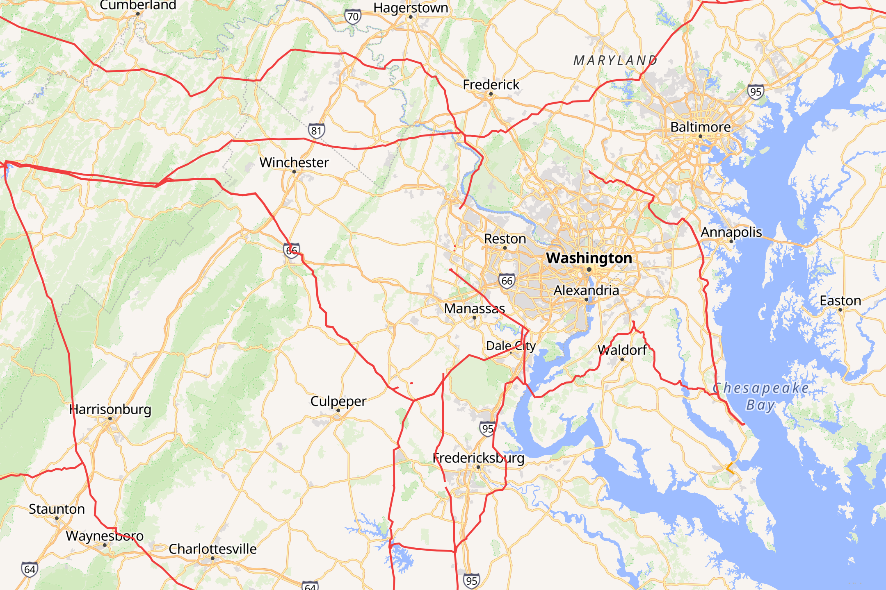
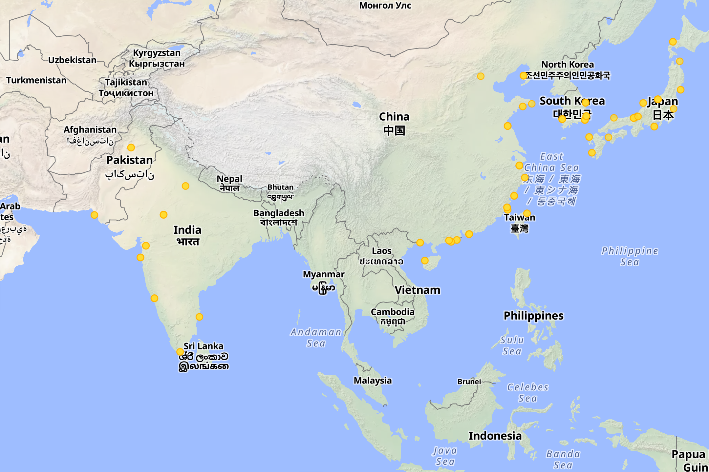

<div align="center">

# 🌍 WorldMap Infrastructure Explorer

**Real-time global infrastructure visualization on a single interactive map.**

Live ships · flights · weather · energy grids · pipelines · nuclear reactors · traffic · ports · airports

[](https://github.com/leonsuv/worldmap/blob/main/.github/workflows/ci.yml)
[](LICENSE)

</div>

---

## Screenshots

| Live Ship Tracking | Pipeline & HV Networks |
|:---:|:---:|
|  |  |

| HV Power Grid | Nuclear Reactors |
|:---:|:---:|
|  |  |

---

## Features

- **14+ map layers** toggled independently — ships, flights, weather, traffic, airports, seaports, nuclear reactors, pipelines, HV power lines, energy infrastructure, 3D buildings, and more
- **Live AIS ship tracking** via WebSocket — MMSI, IMO, vessel type, course, speed, destination, ETA, cargo
- **Live flight tracking** via OpenSky Network — callsign, origin, altitude, velocity
- **Weather overlay** — temperature, precipitation, wind, cloud cover from Open-Meteo
- **Traffic flow** — real-time congestion data from TomTom
- **Vector tile layers** — pipelines, power grids, HV lines rendered from `.mbtiles`
- **Click-to-inspect** — detailed panels for ships and flights with full metadata
- **Self-hosted & lightweight** — single Rust binary + SQLite, no external database cluster

## Tech Stack

| Component | Technology |
|---|---|
| Backend | Rust, Axum 0.8, rusqlite, tokio, reqwest |
| Frontend | React 19, TypeScript, Vite, MapLibre GL JS, deck.gl |
| Storage | SQLite (`cache.db`, `static.db`, `*.mbtiles`) |
| Data Ingestion | Python 3 scripts |
| CI/CD | GitHub Actions (Linux, macOS, Windows) |

## Quick Start

```sh
# 1. Clone
git clone https://github.com/leobak/worldmap.git
cd worldmap

# 2. Configure API keys
cp backend/.env.example backend/.env
# Edit backend/.env and add your API keys (see below)

# 3. Setup & run
make setup   # install deps, create venv, ingest static data
make dev     # start backend + frontend dev servers
```

Backend: `http://localhost:3000` · Frontend: `http://localhost:5173`

## Prerequisites

- [Rust](https://rustup.rs/) (stable)
- [Node.js](https://nodejs.org/) ≥ 20
- Python 3.10+
- Optional: [tippecanoe](https://github.com/felt/tippecanoe) + GDAL (for building `.mbtiles`)

## Make Targets

| Target | Description |
|---|---|
| `make setup` | One-time setup: install deps, create venv, ingest data |
| `make dev` | Start backend + frontend dev servers in parallel |
| `make build` | Production build: Rust release binary + Vite bundle |
| `make ingest` | Re-run all Python data ingestion scripts |
| `make tiles` | Build vector tiles from GeoPackage sources |
| `make clean` | Remove build artifacts |

## Manual Setup

```sh
# Backend
cd backend
cp .env.example .env   # fill in your API keys
cargo run

# Frontend (separate terminal)
cd frontend
npm install
npm run dev

# Data ingestion (one-time)
cd scripts
python3 ingest_airports.py
python3 ingest_seaports.py
python3 ingest_reactors.py
```

## Configuration

### Environment Variables

| Variable | Required | Description |
|---|---|---|
| `AISSTREAM_API_KEY` | Yes | AIS ship tracking WebSocket stream |
| `OPENSKY_CLIENT_ID` | No | OpenSky OAuth2 client (higher rate limits) |
| `OPENSKY_CLIENT_SECRET` | No | OpenSky OAuth2 secret |
| `TOMTOM_API_KEY` | No | TomTom traffic flow overlay |
| `DATA_DIR` | No | Data directory (default: `../data`) |
| `FRONTEND_DIR` | No | Frontend dist path (default: `../frontend/dist`) |
| `BIND_ADDR` | No | Listen address (default: `0.0.0.0:3000`) |

### API Keys

All external APIs used offer free tiers. No paid accounts are required.

| Service | Free Tier | Sign Up |
|---|---|---|
| [AISstream](https://aisstream.io) | Free WebSocket stream | Required |
| [OpenSky Network](https://opensky-network.org) | ~400 credits/day (anon), ~4000 (auth) | Optional |
| [Open-Meteo](https://open-meteo.com) | Unlimited (non-commercial) | Not required |
| [TomTom](https://developer.tomtom.com) | 2,500 req/day | Optional |
| [Nominatim](https://nominatim.org) | 1 req/s | Not required |
| [OpenFreeMap](https://openfreemap.org) | Unlimited | Not required |

### Tile Data

Place `.mbtiles` files in `data/tiles/`. They are auto-discovered at startup and served at `/tiles/{source}/{z}/{x}/{y}`.

## Project Structure

```
├── backend/          # Rust Axum server
│   └── src/
│       ├── main.rs           # Server entry, route registration
│       ├── routes/           # API endpoint handlers
│       ├── db.rs             # SQLite schema & queries
│       ├── state.rs          # Shared application state
│       └── ws_fanout.rs      # WebSocket fan-out for AIS
├── frontend/         # React + Vite SPA
│   └── src/
│       ├── layers/           # deck.gl / MapLibre layer definitions
│       ├── store/            # Zustand state stores
│       ├── ui/               # React UI components
│       └── map/              # Map container
├── scripts/          # Python ingestion & tile build scripts
├── data/             # Runtime data (not in git)
│   ├── tiles/                # .mbtiles vector tile files
│   ├── cache.db              # API response cache (auto-created)
│   └── static.db             # POI data (populated by scripts)
├── .github/workflows/        # CI/CD pipelines
├── Makefile
└── LICENSE
```

---

## ⚠️ Legal Notice & Disclaimer

### Important: Read Before Use

This software is provided **for educational and research purposes**. By using this software, you acknowledge and accept full responsibility for ensuring your use complies with all applicable laws and regulations in your jurisdiction.

### Data Source Terms of Service

This application aggregates data from multiple third-party APIs. **Each data source has its own terms of service, rate limits, and usage restrictions.** It is your responsibility to:

1. **Read and comply with the terms of service** of every API you connect to
2. **Respect rate limits** — exceeding them may violate the provider's ToS and result in your access being revoked
3. **Verify commercial use rights** — some APIs (notably Open-Meteo, Nominatim, OpenFreeMap) are free for non-commercial use only. Commercial use may require a paid license or explicit permission

### AIS & Maritime Data

- AIS (Automatic Identification System) data is broadcast publicly over radio frequencies. Receiving and displaying AIS data is generally legal in most jurisdictions.
- However, **redistributing, storing, or commercially exploiting AIS data** may be subject to national maritime regulations and the data provider's terms.
- Some jurisdictions restrict tracking of military, government, or certain flagged vessels. Ensure compliance with local maritime law.

### Aviation Data (OpenSky Network)

- OpenSky Network data is provided under their specific [terms of use](https://opensky-network.org/about/terms-of-use).
- Tracking military aircraft or using flight data for surveillance purposes may be restricted or illegal in certain jurisdictions.
- If you use OpenSky data in academic publications, proper citation is required.

### Web Scraping & API Usage

- The ingestion scripts in `scripts/` fetch data from various public sources (OurAirports, OpenStreetMap Overpass, GeoNuclearData).
- **Automated data collection may violate certain websites' terms of service**, even when the data itself is publicly available.
- Overpass API (OpenStreetMap) has strict [usage policies](https://operations.osmfoundation.org/policies/nominatim/). Heavy or abusive querying is prohibited.
- Always use appropriate request intervals and respect `robots.txt` where applicable.

### GIS & Map Data

- OpenStreetMap data is licensed under [ODbL](https://opendatacommons.org/licenses/odbl/). If you distribute derived datasets, you must comply with ODbL attribution and share-alike requirements.
- GeoPackage data used for pipeline and power grid tiles may originate from government open-data portals with their own license terms.

### Nuclear Facility Data

- Nuclear reactor locations are sourced from [GeoNuclearData](https://github.com/cristianst85/GeoNuclearData), which compiles publicly available IAEA data.
- Displaying nuclear facility locations is legal in most countries, as this information is publicly available through the IAEA. However, combining it with other operational data could raise security concerns in some jurisdictions.

### No Warranty

THE SOFTWARE IS PROVIDED "AS IS", WITHOUT WARRANTY OF ANY KIND. THE AUTHORS ARE NOT LIABLE FOR ANY CLAIM, DAMAGES, OR OTHER LIABILITY ARISING FROM THE USE OF THIS SOFTWARE OR THE DATA IT ACCESSES. See [LICENSE](LICENSE) for the full MIT license text.

### Your Responsibility

- **Do not use this tool for illegal surveillance, military intelligence, or any unlawful purpose.**
- **Do not redistribute third-party data** without verifying you have the right to do so.
- **Comply with GDPR** and equivalent data protection laws if you store or process data that could identify individuals (e.g., vessel crew, aircraft operators).
- When in doubt, consult a legal professional in your jurisdiction.

---

## Contributing

Contributions are welcome! Please open an issue or submit a pull request.

## License

[MIT](LICENSE) — Copyright 2026 leonsuv
```
