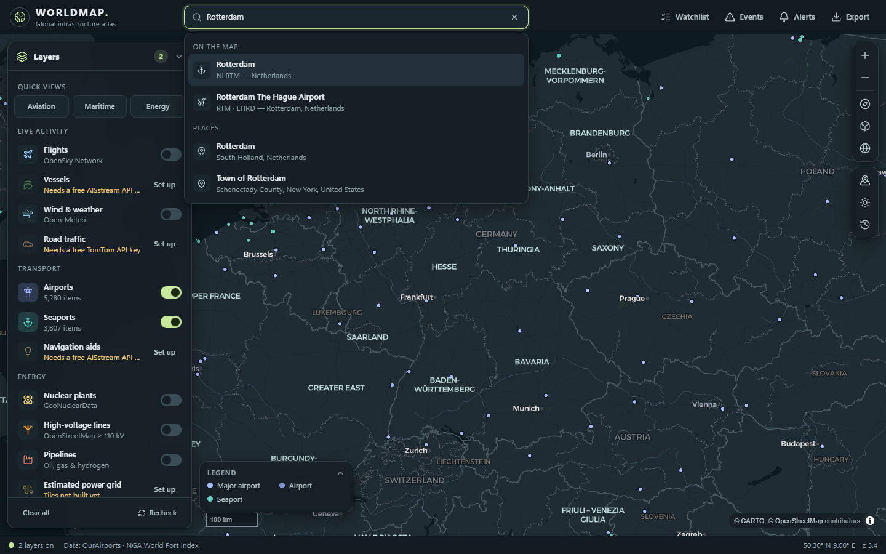
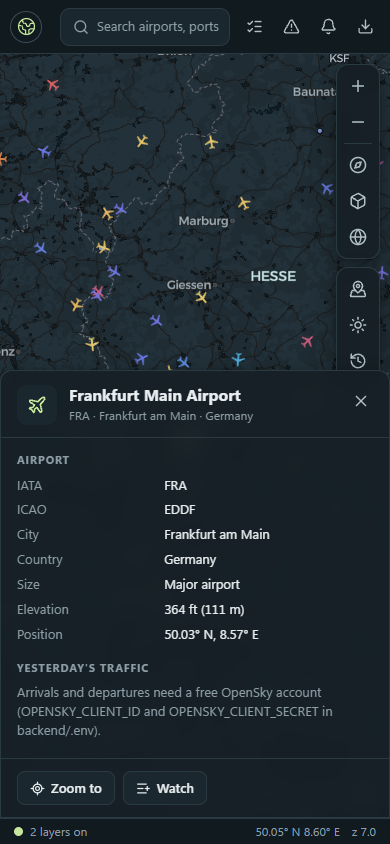

<div align="center">


# WORLDMAP.

### Every connection. One world.

Live flights, vessels and weather together with airports, ports, power lines, pipelines and nuclear plants — in one interactive map that runs on your own computer.

[](https://github.com/leonsuv/worldmap/actions/workflows/ci.yml)
[](LICENSE)

[Quick start](#quick-start) · [Layers](#map-layers) · [Network tiles](#network-tiles) · [Configuration](#configuration) · [Development](#development)

</div>


## What you can do

- **Watch live traffic.** About 12,000 aircraft from OpenSky move smoothly between updates; vessels stream in from AIS with course arrows, voyage data and a 24-hour track.
- **See the infrastructure behind it.** Airports, 3,800 seaports from the World Port Index, nuclear plants with their reactor units, high-voltage lines by voltage class, oil and gas pipelines and an estimated power grid.
- **Find anything.** One search box for airports (IATA/ICAO), ports (UN/LOCODE), plants, live vessels (name, MMSI, IMO) and places worldwide.
- **Monitor what matters.** Put vessels, ports, airports or areas on a watchlist, draw events such as storms or closures on the map, and get alerts when watched items are inside them. Export CSV files and a situation report.
- **Look back.** Vessel positions are recorded every 5 minutes for three days and can be replayed.
- **Choose your view.** Dark and light maps, a globe, 3D buildings, regional shortcuts; works on phones as well.

| Power lines, pipelines and plants | Light map with weather and an aircraft |
|:---:|:---:|
| [](docs/screenshots/atlas-energy.png) | [](docs/screenshots/atlas-light.png) |
| **Search across datasets and places** | **Globe** |
| [](docs/screenshots/atlas-search.png) | [](docs/screenshots/atlas-globe.png) |

<details>
<summary><strong>On a phone</strong></summary>



</details>

## Quick start

Works on Windows, macOS and Linux. You need **Python 3.10+**, **Node.js 20.19+ (or 22.12+)** and **Rust** ([rustup.rs](https://rustup.rs)).

```sh
git clone https://github.com/leonsuv/worldmap.git
cd worldmap
python scripts/setup.py   # installs packages, creates backend/.env, imports airports, ports and plants
python scripts/dev.py     # starts the server and the app
```

Open **http://localhost:5173**. Flights, weather, airports, seaports and nuclear plants work straight away without any account.

On Windows use `py` instead of `python` if `python` is not on your PATH. With `make` installed, `make setup` and `make dev` do the same.

<details>
<summary><strong>Run a production build</strong></summary>

```sh
cd frontend && npm ci && npm run build && cd ..
cd backend && cargo build --release
./target/release/worldmap-backend        # Windows: target\release\worldmap-backend.exe
```

The server hosts the app at **http://127.0.0.1:3000**. It finds `data/` and `frontend/dist/` by itself, whether you start it from the repository root or from `backend/`.

Release archives from the [Releases page](https://github.com/leonsuv/worldmap/releases) contain the server, the built app and the scripts. Unpack, copy `.env.example` to `.env` next to the server, and run `python scripts/ingest.py` once to import the datasets.

</details>

## Map layers

| Layer | Source | Needs |
|---|---|---|
| Flights | [OpenSky Network](https://opensky-network.org) | Nothing. A free API client raises the update rate from every 2 minutes to every 30 seconds and enables flight history |
| Vessels, navigation aids | [AISstream.io](https://aisstream.io) | Free API key |
| Wind & weather | [Open-Meteo](https://open-meteo.com) | Nothing |
| Road traffic | [TomTom](https://developer.tomtom.com) traffic flow | Free API key |
| Airports | [OurAirports](https://ourairports.com) | `python scripts/ingest.py` (run by setup) |
| Seaports | [NGA World Port Index](https://msi.nga.mil/Publications/WPI) | `python scripts/ingest.py` |
| Nuclear plants | [GeoNuclearData](https://github.com/cristianst85/GeoNuclearData) | `python scripts/ingest.py` |
| High-voltage lines | OpenStreetMap, 110 kV and above | Nothing (live from zoom 8), or `python scripts/build_tiles.py hv-lines` |
| Pipelines | OpenStreetMap (or OGIM) | Nothing (live from zoom 8), or `python scripts/build_tiles.py pipelines` |
| Estimated power grid | [Gridfinder](https://gridfinder.org) | `python scripts/build_tiles.py power-grid` (a few minutes) |
| 3D buildings | Basemap buildings (OpenStreetMap) | Nothing; zoom in to level 14 |

Layers that are not set up yet show exactly what is missing under **Set up** in the layer panel. After adding a key restart the server; new tiles and re-imported datasets are picked up automatically (or click **Recheck**).

## Network tiles

Power lines, pipelines and the power grid are served from vector tiles. WorldMap has its own tile builder in the server binary, so **no GDAL, tippecanoe or Docker is needed** — only Python and Rust.

**Live mode (no build needed).** Until `hv-lines` or `pipelines` tiles are built, the server fetches them live from the public Overpass servers for the area you look at, from zoom 8. Each new area (about 1.4°) takes roughly 20–90 seconds the first time, depending on how busy the servers are, and is cached for 30 days afterwards. For the zoomed-out view, `python scripts/build_tiles.py hv-lines --backbone` builds just the lines of 300 kV and above for zoom 2–7. A built full tileset always takes over from live mode.

```sh
python scripts/build_tiles.py hv-lines                     # worldwide transmission lines from OpenStreetMap
python scripts/build_tiles.py hv-lines --bbox 5,47,16,55   # just a region (west,south,east,north) — minutes instead of hours
python scripts/build_tiles.py pipelines                    # oil, gas and hydrogen pipelines from OpenStreetMap
python scripts/build_tiles.py pipelines --ogim OGIM_v2.7.gpkg   # or the OGIM database (download from Zenodo)
python scripts/build_tiles.py hv-lines --backbone         # only >= 300 kV for zoom 2-7, to pair with live mode
python scripts/build_tiles.py power-grid                   # Gridfinder grid.gpkg (~725 MB download)
python scripts/build_tiles.py all
```

- OpenStreetMap data comes from the public Overpass API in areas that split automatically when they are too dense. Up to 4 areas (`--jobs`) are downloaded at once from the Overpass servers that answer a quick check. Downloads are cached in `data/sources/cache/`, so an interrupted run continues where it stopped. A worldwide build takes a while; please keep the public servers in mind.
- Lines keep their attributes (voltage, operator, name …). Pieces too small to see are snapped away without breaking the network, and connected segments are merged, so lines stay continuous at every zoom.
- The results are `data/tiles/*.mbtiles`. A running server shows them within 30 seconds.

The builder works on any GeoJSON, GeoJSONSeq or GeoPackage (EPSG:4326 or 3857):

```sh
worldmap-backend tiles build -i lines.geojsonl -o data/tiles/my-layer.mbtiles -l mylayer -Z 2 -z 12
worldmap-backend tiles tables data/sources/grid.gpkg      # list GeoPackage tables
worldmap-backend tiles inspect data/tiles/hv-lines.mbtiles --tile 6/34/21
```

Per-feature zoom ranges are read from `_minzoom`/`_maxzoom` properties (or tippecanoe's `"tippecanoe": {"minzoom": …}`).

## Configuration

Settings live in `backend/.env` (created from [`backend/.env.example`](backend/.env.example) by setup). Never commit real keys.

| Variable | Purpose | Default |
|---|---|---|
| `AISSTREAM_API_KEY` | Live vessels and navigation aids | Off |
| `TOMTOM_API_KEY` | Road traffic | Off |
| `OPENSKY_CLIENT_ID`, `OPENSKY_CLIENT_SECRET` | Faster flight updates, flight history, airport arrivals/departures | Anonymous |
| `BIND_ADDR` | Listen address. `0.0.0.0:3000` makes the app reachable from your network — the API has no login, so only do this on a trusted network | `127.0.0.1:3000` |
| `DATA_DIR` | Databases and tiles | `<repository>/data` |
| `FRONTEND_DIR` | Built app | `<repository>/frontend/dist` |
| `CORS_ALLOW_ORIGINS` | Other web origins allowed to call the API (comma-separated) | Same origin only |
| `RUST_LOG` | Log level | `info` |

## How it works

```text
Browser (React, MapLibre GL, deck.gl)
  │  REST + WebSocket (vessels in 1-second batches)
  ▼
worldmap-backend (Rust, Axum, Tokio)
  ├─ AIS stream client ─────────── AISstream.io
  ├─ Cached proxies ────────────── OpenSky · Open-Meteo · TomTom · Nominatim
  │    (stale fallback, request coalescing, rate-limit cool-down)
  ├─ cache.db (SQLite) ─────────── cache, live vessels, 3-day history, watchlist, events, alerts
  ├─ static.db (SQLite) ────────── airports, seaports, nuclear plants (served pre-compressed)
  └─ data/tiles/*.mbtiles ──────── vector tiles for networks
```

Imported points (airports, ports, plants) are drawn by MapLibre with collision-aware labels; networks, traffic and 3D buildings are inserted below the basemap labels. High-volume live data (aircraft, vessels, wind) is drawn by deck.gl and scales with the zoom level.

<details>
<summary><strong>API overview</strong></summary>

| Endpoint | |
|---|---|
| `GET /api/status` | Configured keys, available tiles and datasets, AIS connection |
| `GET /api/search?q=…&places=true` | Airports, ports, plants, vessels and places |
| `GET /api/flights` | All aircraft (compact rows) |
| `GET /api/flights/track?icao24=…` · `/aircraft` · `/airport` | Flight path, history, arrivals/departures |
| `WS /api/ships/ws` · `GET /api/ships/snapshot` · `/api/ships/{mmsi}` · `/api/ships/aton` | Vessels and navigation aids |
| `GET /api/weather/grid?bbox=…` · `/api/weather?lat=…&lon=…` | Weather grid and 24-hour point forecast |
| `GET /api/traffic/{z}/{x}/{y}` | Traffic flow tiles |
| `GET /api/airports` · `/api/seaports` · `/api/reactors` | Datasets as GeoJSON |
| `/api/watchlist` · `/api/events` · `/api/alerts` | Monitoring (GET/POST/DELETE) |
| `GET /api/history/timestamps` · `/ships?at=…` · `/track?mmsi=…` | Recorded vessel positions |
| `GET /api/export/csv?type=ships\|events\|alerts\|watchlist\|affected` · `/api/export/report` | Exports |
| `GET /tiles/{source}/{z}/{x}/{y}` · `/tiles/{source}/tilejson.json` | Vector tiles |

</details>

## Development

```sh
cd frontend && npm run lint && npm test && npm run build
cd backend  && cargo fmt --check && cargo clippy --all-targets -- -D warnings && cargo test
python scripts/smoke_test.py --write      # against a running server
```

CI runs all of this on Linux, macOS and Windows, builds a sample tileset with the tile builder and runs the smoke test against a live server.

Without an AIS key you can point the server at a recorded or simulated AISstream feed with `AISSTREAM_URL=ws://…` (any non-empty `AISSTREAM_API_KEY` enables the client). Append `?debug` to the app URL to reach the stores from the browser console as `window.worldmap`.

<details>
<summary><strong>Project layout</strong></summary>

```text
backend/src/
  ais/          AIS parsing, live vessel store, stream client
  routes/       HTTP API
  tilegen/      Vector tile builder (MVT encoder, clipping, GeoPackage/GeoJSON readers, MBTiles)
  config.rs     Environment and path resolution
  upstream.rs   Cached third-party requests
frontend/src/
  data/         Live feeds (flights, vessels, weather, datasets)
  map/          Map, deck.gl layers, MapLibre overlays, interaction
  store/        Application state
  ui/           Panels and controls
scripts/        setup, dev, ingest, build_tiles, smoke_test (Python, standard library only)
data/           Local databases, sources and tiles (not in Git)
```

</details>

<details>
<summary><strong>Troubleshooting</strong></summary>

- **The map stays empty.** WebGL 2 must be available; try another browser or enable hardware acceleration.
- **"Server not reachable".** Start the server (`python scripts/dev.py`). Another program may be using port 3000 — set `BIND_ADDR`.
- **Flights stop updating.** Anonymous OpenSky access allows about 100 worldwide updates per day. WorldMap then shows the last positions and resumes automatically; a free OpenSky API client helps.
- **Windows: the tile script cannot rebuild the tile builder.** A running server locks the executable; the script then uses the existing build.

</details>

## License and data

WorldMap is [MIT licensed](LICENSE). Map data and services keep their own licenses and terms — see [data sources and notices](docs/DATA-SOURCES.md). Basemaps © CARTO, © OpenStreetMap contributors.
