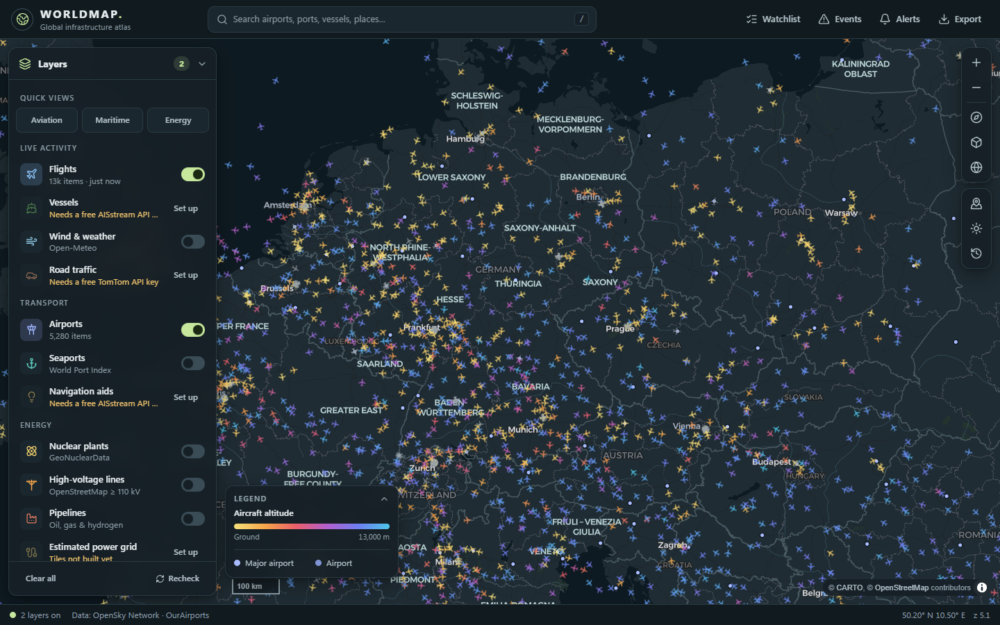
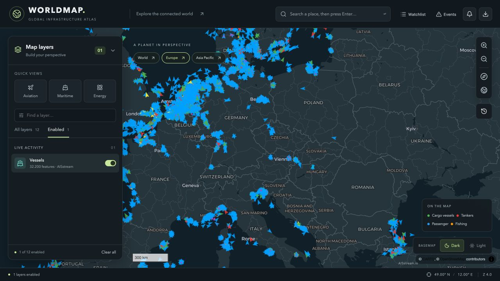
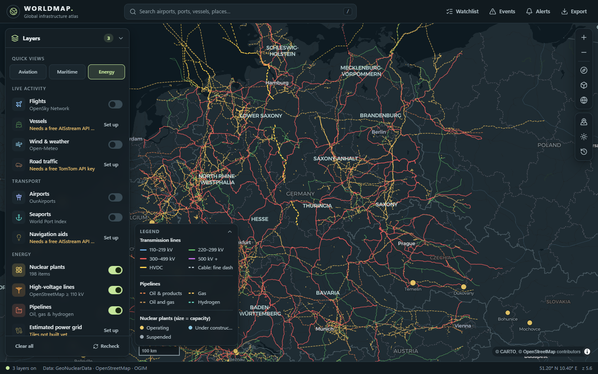
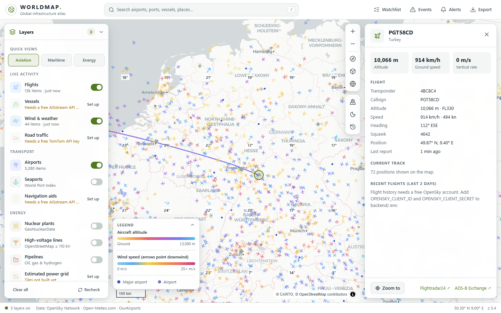
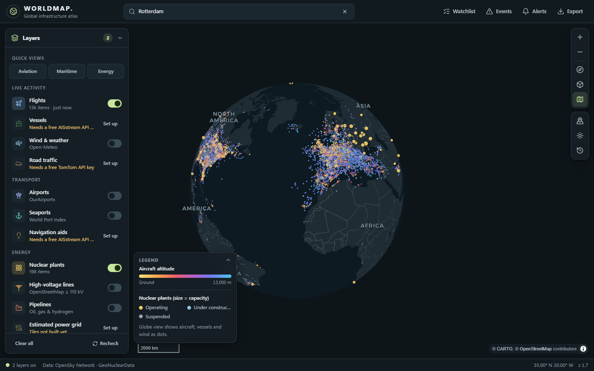

<div align="center">


# WORLDMAP.

### Every connection. One world.

Explore global transport, energy infrastructure and live activity in one interactive atlas.

[](https://github.com/leonsuv/worldmap/actions/workflows/ci.yml)
[](LICENSE)


[Quick start](#quick-start) · [Gallery](#gallery) · [Map layers](#map-layers) · [Configuration](#configuration) · [Development](#development)

</div>



## A planet in perspective

Follow vessels, inspect airports and reactors, compare infrastructure, or explore the globe. WorldMap brings these views together with a focused interface, clear legends and controls that work on desktop and mobile.

- **Explore your way.** Dark and light basemaps, a 3D globe, regional shortcuts and place search with keyboard navigation.
- **Build a view.** Twelve independent layers, searchable groups and aviation, maritime and energy presets.
- **Inspect the details.** Select features, examine vessel and flight information, and replay stored ship positions.
- **Keep track.** Watchlists, geographic events, alerts and data exports.
- **Run it yourself.** React and WebGL in the browser; a Rust server and SQLite on your machine.

## Gallery

Actual screenshots of the current application. Live counts and coverage vary with the connected data sources.

### Live maritime activity



| Energy infrastructure · Dark | The same view · Light |
|:---:|:---:|
| [](docs/screenshots/atlas-energy.png) | [](docs/screenshots/atlas-light.png) |
| Capacity-scaled markers and a focused layer panel. | A lighter basemap for comparing geography and locations. |

<details>
<summary><strong>Explore the globe</strong></summary>



Switch between the flat atlas and globe with the map controls.

</details>

## Map layers

| Layer | Source / requirement |
|---|---|
| Vessels | AISstream live feed; API key required |
| Flights | OpenSky Network; optional OAuth credentials |
| Wind & weather | Open-Meteo |
| Road traffic | TomTom; API key required, visible at street scale |
| Airports | OurAirports; imported into the local database |
| Seaports | OpenStreetMap; imported into the local database |
| Navigation aids | AISstream buoys and beacons |
| Nuclear reactors | GeoNuclearData / IAEA-derived data; local import |
| Pipelines | Local pipeline vector tiles |
| Power grid | Local Gridfinder vector tiles |
| High-voltage lines | Local OpenStreetMap vector tiles |
| 3D buildings | Basemap building data at street scale |

Layers with missing API keys or local tiles stay disabled and are excluded from presets. Open **Data source setup** for the exact setup steps, then restart the backend and select **Recheck**. Empty navigation-aid data is shown as waiting for AIS reports, rather than a failed feed. Historical replay requires previously recorded ship snapshots. Coverage and freshness depend on the source.

## Quick start

**Requirements:** stable Rust, Node.js 22.12+ and Python 3.10+. The setup scripts use Bash and Make. GDAL and tippecanoe are optional tools for generating vector tiles.

```sh
git clone https://github.com/leonsuv/worldmap.git
cd worldmap

# Install dependencies and import airports, seaports and reactors.
# Also creates backend/.env from the example when absent.
make setup

# Edit backend/.env to enable the live feeds you want.
make dev
```

Open **[localhost:5173](http://localhost:5173)**. The API runs at **[localhost:3000](http://localhost:3000)**.

No API key is needed to explore the basemap and imported static datasets. `make setup` downloads data; building optional tiles requires their source files and additional tools.

<details>
<summary><strong>Production build</strong></summary>

```sh
make build
cd backend
./target/release/worldmap-backend
```

The backend serves the built frontend at [localhost:3000](http://localhost:3000). Run it from `backend/` so the default data and frontend paths resolve correctly. On Windows, the binary has an `.exe` extension.

</details>

## Configuration

Set these values in `backend/.env`. Keep credentials out of Git.

| Variable | Purpose | Default |
|---|---|---|
| `AISSTREAM_API_KEY` | Enables live vessels and navigation aids | Disabled without a key |
| `OPENSKY_CLIENT_ID` | OpenSky OAuth client ID | Anonymous access |
| `OPENSKY_CLIENT_SECRET` | OpenSky OAuth client secret | — |
| `TOMTOM_API_KEY` | Enables road traffic | Disabled without a key |
| `DATA_DIR` | Database and tile directory | `../data` |
| `FRONTEND_DIR` | Built frontend directory | `../frontend/dist` |
| `BIND_ADDR` | HTTP listen address | `0.0.0.0:3000` |

### Optional network tiles

Place the generated MBTiles in `data/tiles/` and restart the backend:

```text
data/tiles/
├── pipelines.mbtiles
├── power-grid.mbtiles
└── hv-lines.mbtiles
```

The source names and internal tile layers must match the app. The supplied builders create the expected format:

```sh
make pipeline-tiles   # Pipeline source download and tile build
make grid-tiles       # Power grid and high-voltage tile build
```

These jobs require GDAL and tippecanoe and may download large datasets. See [the scripts](scripts/) before running them.

## Built for smoother exploration

Layer updates are scheduled when data changes, unchanged layers are reused, and live vessel updates are batched. The interface loads before the larger map modules. Static datasets are serialized and compressed once, then served from shared buffers with HTTP caching.

For the measured local airport dataset, gzip reduces the response from **1.08 MB to 195 KB — about 82% less transfer**. This is an endpoint measurement, not a claim about total application speed.

[Read the upgrade report, regression fixes and measurement limits →](docs/upgrade-review.md)

## Development

| Component | Technology |
|---|---|
| Interface | React 19 · TypeScript · Zustand · Vite |
| Map rendering | MapLibre GL JS 6 · deck.gl 9.4 |
| API & live feeds | Rust · Axum · Tokio · WebSockets |
| Storage | SQLite · GeoJSON · MBTiles |
| Data import | Python |
| Checks | ESLint · Vitest · Rust tests · HTTP smoke checks |

```sh
# Frontend checks
cd frontend
npm ci
npm run lint
npm test
npm run build

# Backend regression tests
cd ../backend
cargo test

# From the repository root, with the backend running:
python3 scripts/test_smoke.py
```

GitHub Actions runs frontend checks and backend tests/builds on Linux, macOS and Windows. The current regression suite contains **22 frontend tests, 9 Rust tests and 17 HTTP smoke checks**.

<details>
<summary><strong>Project layout</strong></summary>

```text
backend/src/          API routes, caching, persistence and live feeds
frontend/src/
  layers/             Map layers and update scheduling
  map/                Map runtime, styles and integration
  store/              Application state
  ui/                 Controls and panels
frontend/tests/       Frontend regression tests
scripts/              Setup, ingestion, tile builders and smoke checks
docs/                 Screenshots and upgrade notes
data/                 Local runtime data; excluded from Git
```

</details>

## Contributing & license

Bug reports and contributions are welcome. Include reproduction steps and relevant layer/data-source information when reporting a problem.

WorldMap is [MIT licensed](LICENSE). Map data and third-party services retain their own licenses and terms; see the [project's data-source notices](docs/DATA-SOURCES.md). Basemaps use CARTO and OpenStreetMap attribution displayed in the application.
